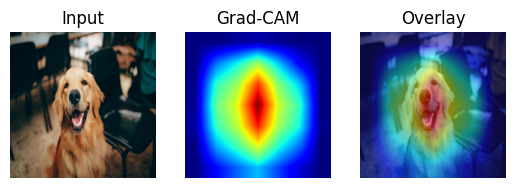

# 🔍 Explainable AI with Grad-CAM (ResNet18)

A quick demo showing how **Grad-CAM** highlights the regions a ResNet18 model focuses on when making predictions.

## What is Grad-CAM?
Grad-CAM generates heatmaps from the gradients of the model’s last convolutional layer, providing visual explanations of its decisions.

## Demo
Upload an image to see a heatmap overlay that reveals the most important regions.

## Tech Stack
- **PyTorch**  
- **Pretrained ResNet18**  
- **Matplotlib**

## How it Works
1. Load the model  
2. Hook activations and gradients  
3. Run inference  
4. Backpropagate  
5. Generate heatmap  

## Why?
Explainability builds trust and helps debug deep learning models.

## Next Steps
Try it on your own images or datasets, or extend it into an interactive app for exploring explanations.

